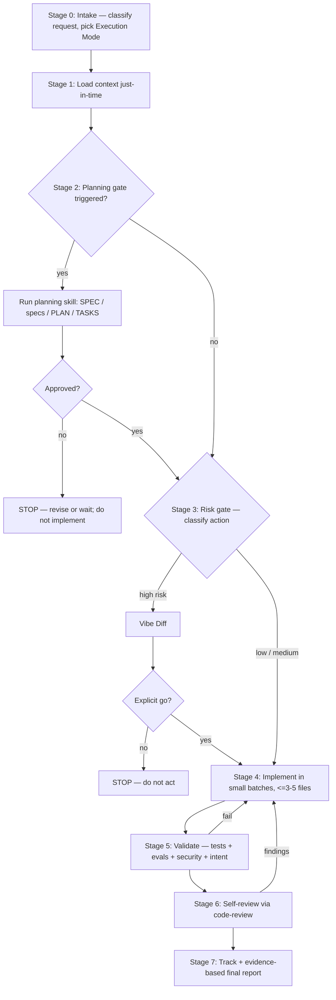

# AGENT_WORKFLOWS

Detailed expansion of `AGENTS.md` §4 (Execution Modes) and §5 (Standard Workflow), plus
the rules for parallel subagents. `AGENTS.md` stays lean; the detail lives here.

> Throughout this file, a bare `§N` refers to a section of **`AGENTS.md`**.

## Workflow diagram (Stage 0–7)

The two back-edges are bounded, not infinite: see the Stage 5 retry rule below.

## Execution Modes

Each mode is a behavioral contract: pick one at Stage 0 and stay in it until the task
changes. Modes constrain *what the agent is allowed to do*, not just its tone.

| Mode | Purpose | Allowed | Not allowed | Linked skill |
|------|---------|---------|-------------|--------------|
| **Architect** | Design & plan | Write SPEC/PLAN/TASKS, research, compare options | Production code | `planning` |
| **Builder** | Implement an approved plan | Edit/create code within scope, small batches, show diffs | Scope creep, unapproved deps | — |
| **Forensic** | Diagnose & fix a bug | Reproduce, add failing test, fix root cause, regression test | Speculative fixes, unrelated refactors | `bug-forensics` |
| **Reviewer** | Review a change | Read, analyze, report findings (risk-ranked) | **Editing code unless asked** | `code-review` |
| **Author** | Write docs/prose | Create/update docs, README, comments | Behavior change | `docs-maintenance` |
| **Librarian** | Organize/retrieve knowledge | Search, summarize, index, cross-link | Behavior change | — |
| **Discussion** (default) | Refine, compare, advise | Questions, options, tradeoffs | Edits, installs, implementation |

Mode transitions: state the switch explicitly (e.g. "switching from Architect to Builder
now that the plan is approved"). Reviewer never silently turns into Builder.

## Stage detail
- **Stage 0 — Intake.** Read `AGENTS.md`. Classify the request (discussion / planning /
  implementation / validation / maintenance). Pick a mode.
- **Stage 1 — Context.** Load only what the request needs (`AGENTS.md` §3, Source of
  Truth). Don't preload everything; retrieve just-in-time.
- **Stage 2 — Planning gate.** See `AGENTS.md` §6 (Planning Gate) and the `planning` skill.
- **Stage 3 — Risk gate.** See `AGENTS.md` §7 (Risk Gate) and `docs/SECURITY.md`.
- **Stage 4 — Implement.** Small batches (≤3–5 files); don't mix refactor and fix; don't
  weaken tests; placeholders for sensitive values.
- **Stage 5 — Validate.** `docs/EVALS.md` for AI behavior; tests for deterministic.
  Iterate until green, but **bounded**: after 2–3 failures of the *same* check, stop
  tweaking. Reflect — form a hypothesis for why the approach is wrong, re-read SPEC/PLAN;
  if the problem is at plan level, reopen the planning gate (§6) rather than patching
  symptoms. Repeated failed attempts pollute the context and degrade further tries.
- **Stage 6 — Self-review.** `code-review` skill + `docs/CODE_REVIEW.md`. When subagents
  are available, run the review in a **fresh-context subagent** (the `reviewer` agent, if
  the project ships one): input is the diff + checklist + relevant SPEC/TASKS,
  findings-only. A fresh context avoids confirming your own in-context assumptions.
- **Stage 7 — Track & report.** Update TASKS / MEMORY / NOTES; conditional `AGENT_RUNS.md`;
  evidence-based final report.

## Subagents: context isolation and parallel work

Subagents serve two distinct purposes — isolation first, parallelism second:
1. **Context isolation** — valid even for sequential work: a fresh-context reviewer
   (Stage 6), or deep research whose intermediate noise shouldn't pollute the main
   context. A subagent sees only its brief, so it reasons cleanly — this is the primary
   value, not "multi-agent intelligence".
2. **Parallelism** — independent tasks executed concurrently.

Prefer sequential work for small tasks. Parallelize (with subagents, when available) only
when tasks are independent, clearly scoped, and don't touch the same files or shared
contracts. If subagents aren't available, do the work sequentially — don't invent a
workaround — and keep the same validation standards.

### When to use
Good candidates (read / research / review — low conflict risk):
- Reading or searching separate areas of the codebase; large-codebase exploration.
- Researching a specific tool, API, or dependency.
- Reviewing an isolated file or module.
- Investigating an independent test or runtime failure.
- Running independent validation checks.

Parallel *implementation* is also possible, but only for work already approved under the
planning gate, where each task:
- is atomic and clearly described in `TASKS.md`;
- has no dependency on another in-progress task;
- does not edit the same files as another parallel task;
- does not change shared contracts (types / APIs / schemas) still under design;
- has a clear validation method and a result the main agent can integrate.

Good implementation candidates: independent modules with stable interfaces, separate UI
components, independent endpoints with approved contracts, isolated tests, docs for
separate areas, unrelated bug fixes.

### When NOT to use
- Unclear product or architecture decisions (need one shared source of truth).
- Dependency installation, package-manager, or migration steps.
- Destructive or high-risk operations.
- Security, privacy, auth, payment, or sensitive-data changes.
- Edits to the same files, or shared contracts still being designed.
- Tasks whose order is unclear.

### How to use
1. **Map dependencies first.** Read `PLAN.md` (phases, boundaries, shared contracts) and
   `TASKS.md` (atomic tasks, dependencies, expected files). If `TASKS.md` doesn't show
   dependencies / expected files / touched areas, fix that first or ask — don't guess.
2. **Brief each subagent self-contained** (it starts cold, with no shared memory). Give it:
   exact task scope; files/modules likely involved; files/areas to avoid; expected output;
   the validation command or manual check; and an explicit "no unrelated refactors".
3. **Isolate writes.** Two agents must never edit the same file. For parallel file
   mutation, give each its own area (or an isolated worktree).
4. **Return a distilled summary.** Each subagent returns ≈1–2k tokens of findings/results,
   not raw dumps.
5. **Main agent integrates.** Review every result, reject unrelated changes, resolve
   conflicts, ensure consistency with SPECIFICATION / PLAN / TASKS, run final integration
   validation, update `TASKS.md`, and report what was parallelized and how it was verified.

The main agent always owns scope, approval, integration, validation, planning-doc updates,
and the final answer. Subagents never bypass planning, approval, validation, or safety.

### Example
> Review three unrelated modules before a release.
> Dispatch three Reviewer subagents, one per module, each briefed with its file path, the
> review checklist (`docs/CODE_REVIEW.md`), and "findings only, no edits". Each returns a
> short risk-ranked findings list. The main agent merges and dedupes them into one review
> summary, then decides what to act on.
